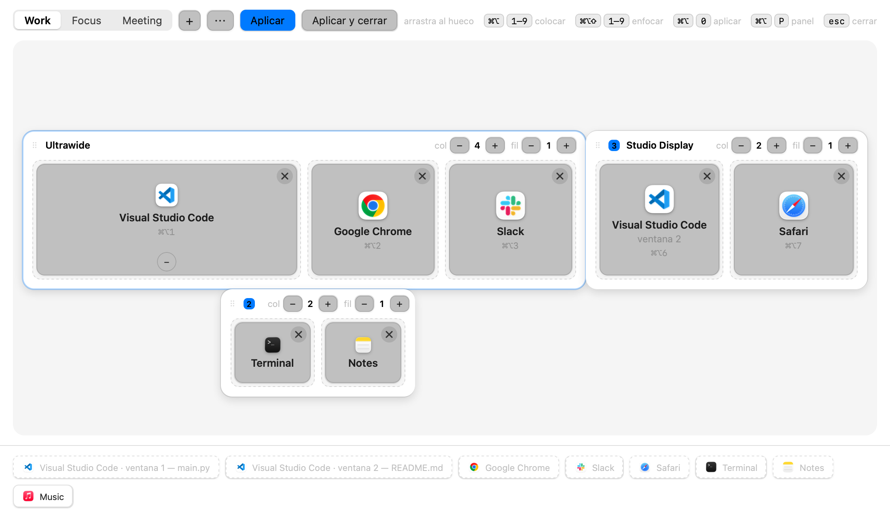

# Trisplit

Grid window manager for macOS, written in native Swift. Every monitor gets its own
`cols × rows` grid, apps are assigned to slots, and one shortcut puts every window back
where it belongs. Multiple named configurations (Work, Meeting, ...), a native panel with
a to-scale map of your desk, and monitor re-arrangement through
[displayplacer](https://github.com/jakehilborn/displayplacer).

<picture>
  <source media="(prefers-color-scheme: dark)" srcset="docs/screenshot-dark.png">
  <source media="(prefers-color-scheme: light)" srcset="docs/screenshot-light.png">
  
</picture>

## Install

Requires macOS 13+ on Apple silicon (arm64).

### Homebrew

```bash
brew install --cask pocharlies-org/tap/trisplit
open -a Trisplit
```

The app is signed with a self-signed certificate and is not notarized; the cask removes the
quarantine attribute on install. Optional: `brew install displayplacer` for monitor re-arrangement.

### From source

Needs the Xcode Command Line Tools (`swiftc`).

```bash
git clone https://github.com/pocharlies-org/trisplit && cd trisplit
make cert      # optional, recommended: stable signing identity (see "Stable signing")
make install   # builds and copies to ~/Applications/Trisplit.app
open ~/Applications/Trisplit.app
```

On first launch grant **Accessibility**: System Settings → Privacy & Security → Accessibility.

To start at login: `~/Applications/Trisplit.app/Contents/MacOS/Trisplit --login-item on`.

## Usage

Trisplit lives in the menu bar. Open the panel with `⌘⌥P`, drag apps from the tray onto
slots, then press **Apply**.

| Shortcut | Action |
|---|---|
| `⌘⌥0` | Apply the active configuration |
| `⌘⌥⇧0` | Switch to the next configuration |
| `⌘⌥P` | Open the panel |
| `⌘⌥1…9` | Move the focused window to slot N (and remember it) |
| `⌘⌥⇧1…9` | Focus the app/window in slot N |

Slots are numbered across monitors from left to right (by screen position). `App#N` (for example
`Code#2`) addresses the Nth window of an app, minimized windows included.

### Profiles

Profiles (named configurations) are the tabs at the top of the panel.

- **Switch:** click a tab, or use ←/→ to move between tabs and Enter or Space to activate.
- **Rename:** double-click a tab, press F2 (or Enter on the active tab), or use the `⋯` menu. Enter or clicking away saves, Esc cancels. Empty and duplicate names are rejected.
- **Duplicate:** `⋯` → Duplicar copies the active profile (slots and spans included) as "<name> copia" and lets you rename it right away.
- **Reorder:** drag a tab, or press ⌥← / ⌥→ on a focused tab. The active profile stays active. `⌘⌥⇧0` cycles in tab order.
- **Delete:** `⋯` → Eliminar (click twice to confirm). The last profile cannot be deleted.
- **New:** the `+` button creates an empty profile; type its name and press Enter.

## Slots spanning several columns

An app can take several adjacent columns of the same row. In the panel each occupied slot
shows the buttons that apply:

- **◀** (`⇧←`): also take the empty slot on the left.
- **▶** (`⇧→`): also take the empty slot on the right.
- **−** (`⇧↓`): give back one column (only if it spans more than one).

The shortcuts work on the focused slot (Tab to focus it). When placing or widening an app,
windows outside the grid that end up covered are minimized.

In the config file a continuation is written as `"<"`: `["Code", "<", "Slack"]` on 3 columns
gives Code 2/3 and Slack 1/3. A `"<"` never crosses rows and is ignored in the first column
or after an empty slot. `⌘⌥N` counts real slots only (Code is 1, Slack is 2 in the example).

## Files

- Configuration and state: `~/Library/Application Support/trisplit/trisplit.json`
- Log: `~/Library/Logs/Trisplit/trisplit.log`

## CLI and URL scheme

| Flag | Purpose |
|---|---|
| `--selftest` | Internal checks, no UI |
| `--selftest-live` | Checks against real windows and screens (`make live`) |
| `--login-item on\|off\|status` | Manage the login item (SMAppService) |

URLs: `open trisplit://apply`, `open trisplit://next`, `open trisplit://panel`.

## Stable signing

An ad-hoc signature changes on every rebuild and macOS then revokes the Accessibility
permission. To avoid it:

1. Once: `make cert` creates a self-signed `trisplit dev` identity in a dedicated keychain
   (`~/Library/Application Support/trisplit-dev/`), added to your keychain search list.
2. `make install` and `./build.sh` sign with it automatically.
3. Grant Accessibility once more; later rebuilds keep it.

`TRISPLIT_SIGN_ID` (and `TRISPLIT_KEYCHAIN`) take precedence; with no identity the build is
signed ad-hoc with a warning. Remove everything with `make cert-uninstall`.

## Development

```bash
make unit         # Core logic, plain swiftc (no XCTest)
make panel        # panel.html in a headless WKWebView
make test         # both
make live         # self-test against the real desktop
make screenshots  # regenerate docs/screenshot-{light,dark}.png from tests/fixtures/screenshot-state.json
make release      # tag, GitHub release and Homebrew cask bump (needs the dev identity, a clean pushed tree)
```

The version lives in the `VERSION` file. See [ARCHITECTURE.md](ARCHITECTURE.md) for how the
code is organized.

## Known limitations

- Only windows of the current Space are managed.
- Monitor re-arrangement needs `displayplacer` at `/opt/homebrew/bin/displayplacer`.
- Without a stable signing identity you must re-grant Accessibility after each rebuild.
- The panel UI is currently in Spanish.

## License

MIT, see [LICENSE](LICENSE).
